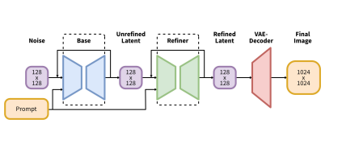
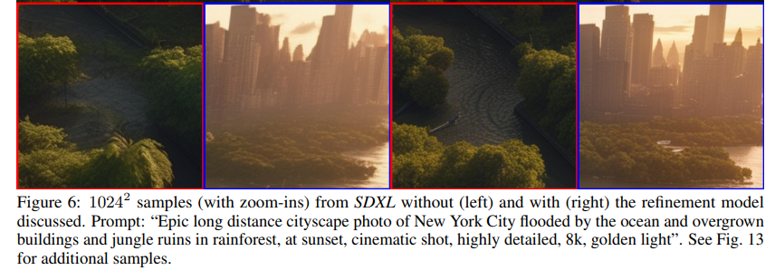

# Stable Diffusion - XL

**paper link : [https://arxiv.org/abs/2307.01952]**

   
 

기존의 Stable Diffusion model의 성능 향상을 초점으로 아래와 같은 개선이 있었음. 

1. Backbone Unet의 parameter를 3배로 증가시킴.   
   - pooling으로 image의 사이즈를 줄이는 단계는 1단계 감소 
   - 다만, 이미지 사이즈에서 transformer block을 증가시키면서 attention에 의한 파라미터가 증가하게 됨.
   - OpenCLIP과 ViT-bigG두 text emb를 모두 concat해서 사용
2. 추가적인(Micro) Conditioning을 제공.
   1. Condition on image size
       - 이전의 stable diffusion에서는 특정 사이즈 이하의 이미지를 버렸음.
       - 혹은, 특정 사이즈 이하의 이미지를 upscale해서 사용했음.
       - 전자의 경우, 너무 많은 training data가 버려지는 문제가 있었음. 후자의 경우, upscale 시키면서 image의 quality가 떨어짐.
       - 그래서 작은 이미지를 upscale 시키기 이전의 original size (width, height)를 Unet의 Conditional input으로 넣어줌.
    2. Condition on Crop image size
       - 생성된 이미지가 다소 잘려서 생성되는 경우가 발생함. (가령, 고양이 이미지를 생성하는 경우에 중앙에 잘 생성하면 잘린 부분 없을 것이지만 센터링이 잘 안되어 잘려서 생성된 케이스가 종종 발생)
       - 아마도 Data augmentation시에 RandomCrop으로 인한 영향으로 예상됨.
       - imageCrop의 (top, left)의 좌표를 Unet의 Conditional input으로 넣어줌.
3. Multi-Aspect Training
   - 대부분의 ComputerVision model은 학습을 512*512, 1024*1024 와 같이 정사각형의 데이터에 대해 학습함. 하지만 실제로는 다양한 ratio의 이미지가 존재
   - 그래서 특정 ratio의 데이터를 한 배치에 넣고 학습시킴. 이 과정에서 이 (width, height)를 Unet의 condition input으로 제공함.
4. Improvement of Autoencoder
   - 기존의 autoencoder를 computation을 늘리고, decoder를 더 finetune 시킴.
5. Add Refinement Stage
   - 가끔씩 sample의 qaulity가 좋지 않은 것을 발견함. 
   - image-to-image 원리를 생각해서, 1차로 latent space를 생성한 이후 뒤 부분에 다시 latent space를 생성할 수 있게 Refiner를 붙임. (쉽게 말해서 같은 작업을 두번 한다고 생각하면 될 듯.)
   - 물론, 시간은 더 걸리지만 quality가 개선되는 것을 볼 수 있었음. (Diffusion model로 생성된 이미지가 보통 끝부분같은, 말단 부분에서 약간 어색한 부분이 있는데 이를 어느정도 refine해 준 것으로 보입니다. )

 

  