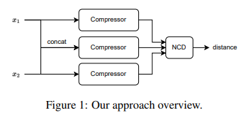

# Low-Resource Text Classification A Parameter-Free Classification Method with Compressors

**paper link : [https://aclanthology.org/2023.findings-acl.426/]**

text classification을 DNN 방식이 아닌 Compression & Classifer 방식을 이용해서 진행함.

- **Introduction**
    > DNN을 이용한 text classifcaiton은 높은 정확도를 보임(Natural Language Process).   
    다만, 모델이 거대해지면서 parameter도 많아지고, 많은 computation을 요구함. 점점 학습에 큰 cost를 요구하게 됨.   
    낮은 cost를 요구하고 non-parameter model을 이용하여 text classification을 진행할 것임.   
    Data를 compression하고 이를 k-mean nearest 방식을 이용하였고, Out of distribution task에서 BERT와 같은 DNN-based method에 비해 높은 정확도를 이끌어 냄.

- **Related works**
    > 기존, Compressor-based text classification 방법론들이 존재했음.
    > 1. compressor를 이용해 도출한 정보를 바탕으로 해당하는 class와 그 data의 entropy의 distance를 줄이는 방식.   
    **(즉, cross entropy를 줄이는 방식이라고 보면 될 것 같음.)**
    > 2. Kolmogorov complexity라는 metric을 이용해서 information간의 distance를 도출하고, 하나를 다른 하나로 convert하는 할때의 distance를 측정하는 방식으로 classification 하는 방식.   
    **(가령, x1과 x2라는 데이터가 있을 때, 이들의 Kolmogorov complexity를 구하고, 그 두 사이의 거리가 작은 경우 같은 class에 배정하는 듯.)**   
     

    > 또한, DNN을 이용한 방식들도 많이 존재함.   
    Graph Convolutional Network, CNN, RNN 등이 있었고, 가장 성능이 좋은 최신 기법은 BERT-base model임.

- **Proposed Method**
  
    

    > Compressor는 data의 regularity를 잘 추출할 것이고 그렇기 때문에 같은 class에 속하는 data들은 compressed된 후, 비슷한 regularity를 가질 것이라고 가정함. 이 방법론에서는 **gzip**을 Compressor로서 사용함.   
    **(일반적으로 우리가 아는 압축파일 만드는 gzip)**   
    C( . )는 gzip compressor를 의미하고, Normalized Compression Distance(NCD)라는 metric이 있는데, 이는 2004년에 한 논문에 증명된 metric으로 이를 사용할 것임.   
    **(Compressor-based model에서 사용하는 metric이라고 생각하면 될 듯.)**   
    실제 implementation은 간단한데, test data와 train data에 대해 NCD값을 계산하고 k-nearist neighbor을 적용.   
    **(가정 "t1"이라는 test data가 있을 때, 모든 train data와 NCD를 계산하고 kNN을 적용했을 때 도출되는 class가 "t1"의 class가 됨.)**   

- **Experiment & Analysis**
    > in-distribution, out-of-distribution dataset 모두 사용   
    (test에 unseen case를 사용하는 것이 후자.)   
    또한 학습이 필요한 DNN model과 기존 다른 학습이 필요하지 않은 모델을 평가에 사용.   
    in-distribution task에서는 bert를 제외하고는 다른 모델을 앞섰음.   
    out-of-distribuition task에서는 bert를 포함 모든 모델보다 월등히 앞선 모습을 보여주었음. 또한 few-shot에서도 bert에 비해 월등한 성능을 보였음.   
    **(few-shot에서 bert가 성능이 안좋을 수밖에 없는 이유는 bert 자체가 학습 데이터를 많이 요구하는데 적은 데이터를 넣었기 때문에 차이가 많이 나는게 아닐까 싶음.)**   
    또한, 다른 method와 비교했을 때, 저자가 제시하는 방법은 큰 규모의 데이터셋 보다는 작거나 중간 사이즈의 dataset에서 성능이 더 좋음을 볼 수 있음.

    

NLP에서는 대개 word mbedding 방식으로 data를 representation하는 반면, 해당 논문에서는 data를 gzip을 이용해서 data representation을 진행함.   
 
전자는 많은 데이터를 바탕으로 sementic representation을 배우지만, 후자는 gzip으로 데이터의 regularity를 학습한다고 하는데, 이 regularity는 학습하는게 아니기도 하고, 비슷한 regularity가 무엇인지 애매한 부분이 있을 것 같음. 가령, A는 B와 특정 의미에서 유사하고, C와는 또 다른 의미에서 유사하다고 했을 때, B, C의 class가 다르면 이러한 부분을 gzip이 잘 반영해 줄 수 있을 것 같지는 않음. 그렇기 때문에 작거나 중간 사이즈의 dataset에서 성능이 잘 나오는 것이라고 생각할 수 있고, 이는 few-shot learning에서 성능이 bert보다 잘 나오는 이유가 될 것이라고 생각함.   
 
사실, gzip을 autoencoder와 같은 DNN-based compressor로 하면 성능이 더 잘 나올 수 있지 않을까라는 생각이 들기도 함. 하지만 gzip으로 압축할 생각은 참신한 것 같다. 